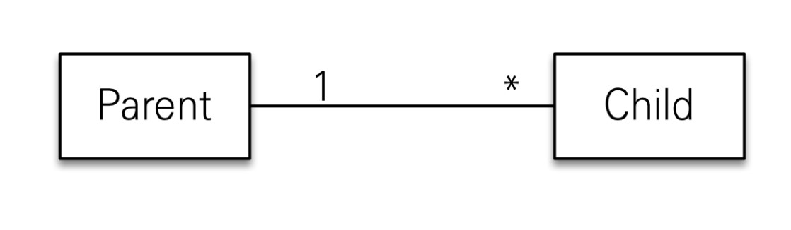
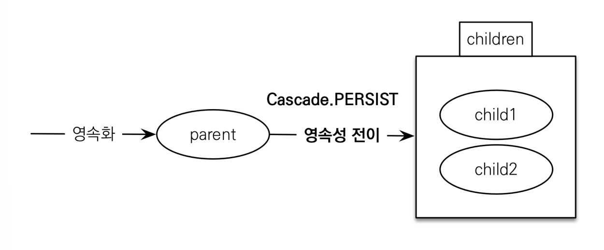

# 영속성 전이 : CASCADE

- 특정 엔티티를 영속 상태로 만들 때 연관된 엔티티도 함께 영속 상태로 만들고 싶을 때
- 예 : 부모 엔티티를 저장할 때 자식 엔티티도 함께 저장.

## 저장

`@OneToMany(mappedBy="parent", cascade=CascadeType.PERSIST)`

## 주의

- 영속성 전이는 연관관계를 매핑하는 것과 아무 관련이 없음
- 엔티티를 영속화할 때 연관된 엔티티도 함께 영속화하는 편리함을 제공할 뿐

## 종류

- ALL : 모두 적용
- PERSIST : 영속
- REMOVE : 삭제
- MERGE : 병합
- REFRESH : REFRESH
- DETACH : DETACH

