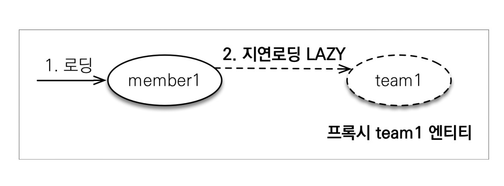
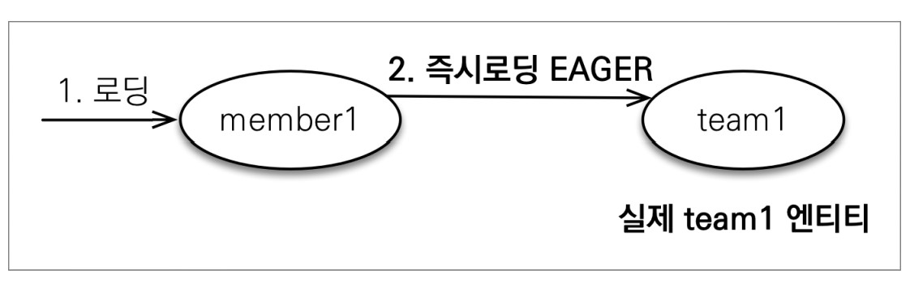
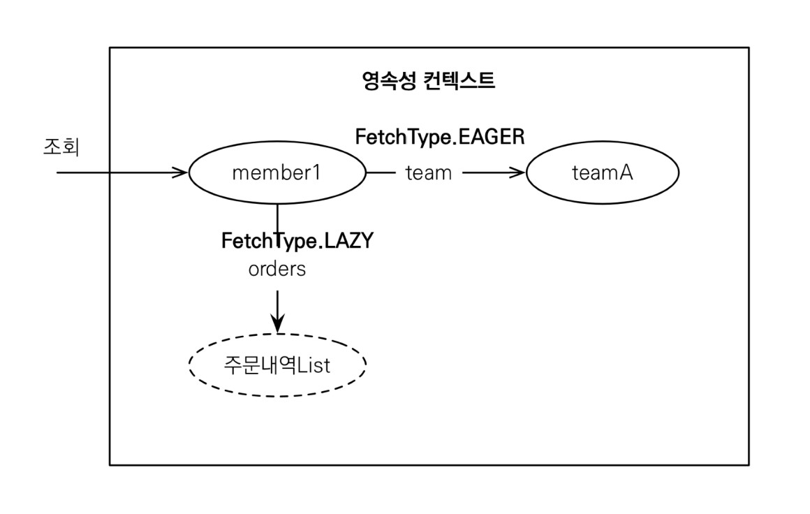

# 지연 로딩

## 지연로딩을 사용해 프록시로 조회

```java

@Entity
public class Member {
    @Id
    @GeneratedValue
    private Long id;

    @Column(name = "USERNAME")
    private String name;

    @ManyToOne(fetch = FetchType.LAZY)
    @JoinColumn(name = "TEAM_ID")
    private Team team;
    
    ..
}
```



```java
Team team=member.getTeam();
        team.getName(); // 실제 team을 사용하는 시점에 초기화 (DB 조회)
```

# 즉시 로딩

## 즉시로딩을 사용해서 함께 조회

```java

@Entity
public class Member {
    @Id
    @GeneratedValue
    private Long id;

    @Column(name = "USERNAME")
    private String name;

    @ManyToOne(fetch = FetchType.EAGER)
    @JoinColumn(name = "TEAM_ID")
    private Team team;
    
    ..
}
```



**Member 조회시 항상 Team도 조회**
JPA 구현체는 가능하면 조인을 사용해서 SQL 한번에 함께 조회

## 프록시와 즉시로딩 주의

- 가급적 지연 로딩만 사용 (특시 실무에서)
- 즉시 로딩을 적용하면 예상하지 못한 SQL이 발생
- 즉시 로딩은 JPQL에서 N+1 문제를 일으킨다.
- `@ManyToOne`, `@OneToOne`은 기본이 즉시 로딩 -> LAZY로 설정
- `OneToMany`, `@ManyToMany`는 기본이 지연 로딩

# 지연 로딩 활용

- Member와 Team은 자주 함께 사용 -> 즉시 로딩
- Member와 Order는 가끔 사용 -> 지연 로딩
- Order와 Product는 자주 함께 사용 -> 즉시 로딩




- **모든 연관관계에 지연 로딩을 사용해라**
- **실무에서 즉시로딩을 사용하지 마라**
- JPQL fetch 조인이나, 엔티티 그래프 기능을 사용해라
- 즉시 로딩은 상상하지 못한 쿼리가 나간다.


