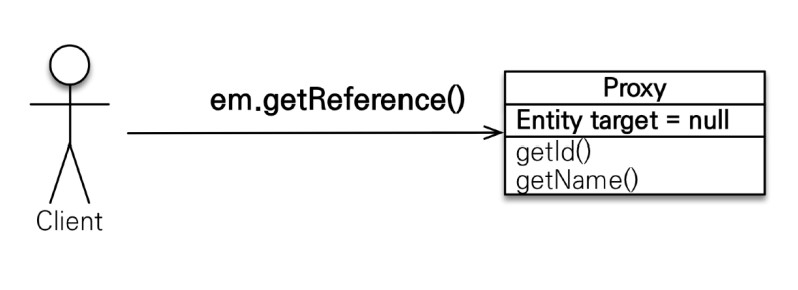
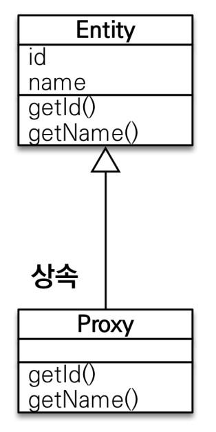
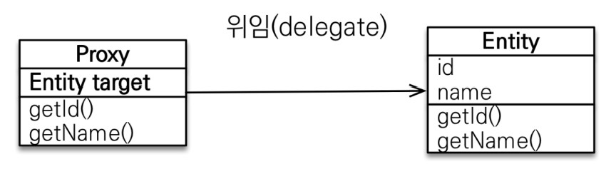
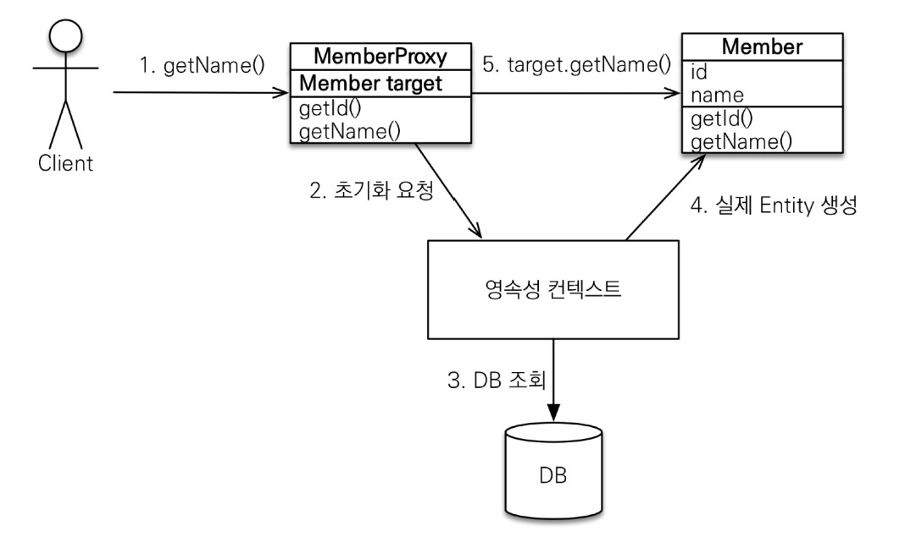

# Proxy

## 기초

- `em.find()` vs `em.getReference()`
- `em.find()` : DB를 통해 실제 엔티티 객체 조회
- `em.getReference()` : DB 조회를 미루는 가짜(프록시) 엔티티 객체 조회



## 특징

- 실제 클래스를 상속 받아서 만들어짐
- 실제 클래스와 겉 모양이 같다.
- 사용하는 입장에서는 진짜 객체인지 프록시 객체인지 구분하지 않고 사용하면됨. (이론상)
  

- 프록시 객체는 실제 객체의 참조(target)를 보관
- 프록시 객체를 호출하면 프록시 객체는 실제 객체의 메소드 호출
  

- 프록시 객체는 처음 사용할 때 한번만 초기화
- 프록시 객체를 초기화할 때, 프록시 객체가 실제 엔티티로 바뀌는 것은 아님. 초기화되면 프록시 객체를 통해서 실제 엔티티에 접근 가능
- 프록시 객체는 원본 엔티티를 상속받음. 따라서 체크시 주의. (== 비교 실패, 대신 instance of 사용)
- 영속성 컨텍스트에 찾는 엔티티가 이미 있으면 `em.getReference()`를 호출해도 실제 엔티티 반환
- 영속성 컨텍스트의 도움을 받을 수 없는 준영속 상태일 때, 프록시를 초기화하면 문제 발생   (하이버네이트는 org.hibernamte.LazyInitializationException 예외를 터뜨림)

## 확인

### 프록시 인스턴스의 초기화 여부 확인

`PersistenceUnitUtil.isLoaded(Object entity)`

### 프록시 클래스 확인 방법

`entity.getClass().getName()` 출력 (..javasist.. or HibernateProxy ...)

### 프록시 강제 초기화

`org.hibernate.Hibernate.initialize(entity);`

### 참고 : JPA 표준은 강제 초기화 없음

강제 호출 : `member.getName()`

## 초기화

```java
Member member=em.getReferene(Member.class,"id1");
        member.getName();
```



