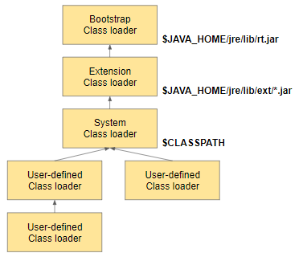

# JVM Class Loader

## Class Loader ?
---
```
런타임 중에 JVM의 메소드 영역에 동적으로 Java클래스를 로드하는 역할
```
자바는 동적 로드, 즉 컴파일 타임이 아닌 런타임(바이트 코드 실행시)에 클래스 로드하고 링크하는 특징이 있다. 이 동적 로드를 담당하는 부분이 JVM의 Class Loader이다.

로딩, 링크, 초기화 단계로 나누어져 있다.

- 로딩
  - 자바 바이트 코드(.class)를 메소드 영역에 저장한다.
  - 각 자바 바이트 코드(.class)는 JVM에 의해 메소드 영역에 다음 정보들을 저장한다.
    - 로드된 클래스를 비롯한 그의 부모 클래스의 정보
    - 클래스 파일과 Class, Interface, Enum의 관련 여부
    - 변수나 메소드 등의 정보
- 링크
  - 검증 : 읽어 들인 클래스가 자바 언어 명세 및 JVM 명세에 명시된 대로 잘 구성되어 있는지 검사한다.
  - 준비 : 클래스가 필요로 하는 메모리를 할당하고, 클래스에서 정의된 필드, 메소드, 인터페이스를 나타내는 데이터 구조를 준비한다.
  - 분석 : 심볼릭 메모리 레퍼런스를 메소드 영역에 있는 실제 레퍼런스로 교체한다.
- 초기화
  - 클래스 변수들을 적절한 값으로 초기화한다. 즉, static 필드들이 설정된 값으로 초기화한다.

## Class Loader의 종류
---


## Bootstrap Class Loader
---
```
자바 클래스를 로드할 수 있는 자바 자체의 클래스 로더와 최소한의 자바 클래스를 로드한다.
```
JVM 시작 시 가장 최초로 실행되는 클래스 로더이다. 자바 클래스를 로드하는 것이 아닌, 자바 클래스를 로드할 수 있는 자바 자체의 클래스 로더와 최소한의 자바 클래스(`java.lang.Object`,`Class`,`ClassLoader`)만을 로드한다.

### Java 8
`jre/lib/rt.jar` 및 기타 핵심 라이브러리와 같은 JDK의 내부 클래스를 로드한다.

### Java 9 이후
더 이상 `/re.jar`이 존재하지 않고, `/lib`내에 모듈화되어 포함됐다. 이제는 정확하게 ClassLoader내 최상위 클래스들만 로드한다.

## Extension Class Loader
---
```
확장 자바 클래스들을 로드한다.
```
확장 클래스 로더는 부트스트랩 클래스 로더를 부모로 갖는 클래스 로더로서, 확장 자바 클래스들을 로드한다. `java.ext.dirs`환경 변수에 설정된 디렉토리의 클래스 파일을 로드하고, 이 값이 설정되어 있지 않는 경우 `${JAVA_HOME}/jre/lib/ext`에 있는 클래스 파일을 로드한다.

### Java 8
`URLClassLoader`를 상속하며, `jre/lib/ext`내 모든 클래스를 로드한다.

### Java 9 이후
`Platform Loader`로 변경되었으며, `URLClassLoader`가 아닌 `BuiltinClassLoader`를 상속한다. Inner Static 클래스로 구현되어 있다.

## System Class Loader
---
```
우리가 만든 .class확장자 파일을 로드한다.
```
자바 프로그램 실행 시 지정한 Classpath에 있는 클래스 파일 혹은 jar에 속한 클래스들을 로드한다.

## ClassLoader의 동작 방식
---
- JVM의 메소드 영역에 클래스가 로드되어 있는지 확인. 로드 되어있다면 해당 클래스 사용.
- 메소드 영역에 클래스가 로드되어 있지 않을 경우, 시스템 클래스 로더에 클래스 로드 요청.
- 시스템 클래스 로더는 확장 클래스 로더에 요청 위임.
- 확장 클래스 로더는 부트스트랩 클래스 로더에 요청 위임.
- 부트스트랩 클래스 로더는 부트스트랩 Classpath(JDK/JRE/LIB)에 해당 클래스가 있는지 확인. 클래스가 존재하지 않는 경우 확장 클래스 로더에 요청 넘김.
- 확장 클래스 로더는 확장 ClassPath(JDK/JRE/LIB/EXT)에 해당 클래스가 있는지 확인. 클래스가 존재하지 않는 경우 시스템 클래스 로더에 요청 넘김.
- 시스템 클래스 로더는 시스템 Classpath에 해당 클래스가 있는지 확인. 클래스가 존재하지 않는 경우 `ClassNotFoundException` 발생시킴.

## ClassLoader가 지켜야할 세 가지 원칙
---
- 위임 원칙
  - 클래스 로더는 클래스 또는 리소스를 찾기 위해 요청을 받았을 때, 상위 클래스 로더에게 책임을 위임하는 위임 모델을 따른다.
- 가시 범위 원칙
  - 하위 클래스 로더는 상위 클래스 로더가 로드한 클래스를 볼 수 있지만, 반대로 상위 클래스 로더는 하위 클래스 로더가 로드한 클래스를 알 수 없다.
  - 이로 인해 `java.lang.Object`클래스 등 상위 클래스 로더에서 로드한 클래스도 하위 클래스 로더인 시스템 클래스 로더 등에서 사용할 수 있다.
- 유일성의 원칙
  - 하위 클래스 로더가 상위 클래스 로더에게 로드한 클래스를 다시 로드하지 않아야 한다는 원칙이다.
  - 위임 원칙에 의해서 위쪽으로 책임을 위임하기 때문에 고유한 클래스를 보장할 수 있다.

## 동적 클래스 로딩
---
자바의 클래스 로딩은 클래스 참조 시점에 JVM에 코드가 링크되고, 실제 런타임 시점에 동적 로딩을 거친다. 런타임에 동적으로 클래스를 로딩한다는 것은 JVM이 미리 모든 클래스에 대한 정보를 메소드 영역에 로딩하지 않는다는 것을 의미한다. 동적으로 클래스를 로딩하는 방식은 두 가지가 있다.

## 로드 타임 동적 로딩 (Load-time Dynamic Loading)
---
```
하나의 클래스를 로딩하는 과정에서 동적으로 다른 클래스를 로딩하는 것
```
```java
public class HelloWorld { 
    public static void main(String[] args) { 
        System.out.println("안녕하세요!"); 
    } 
}
```
위 코드의 경우 다음과 같이 동작한다.

- JVM이 시작되고 부트스트랩 로더가 생성된 후에 모든 클래스가 상속받고 있는 Object클래스를 읽어온다.
- 클래스 로더는 명령 행에서 지정한 HelloWorld클래스를 로딩하기 위해, HelloWorld.class파일을 읽는다.
- HelloWorld클래스를 로딩하는 과정에서 필요한 클래스인 `java.lang.String`과 `java.lang.System`을 로딩한다.


## 런타임 동적 로딩 (Run-time Dynamic Loading)
---
```
클래스를 로딩할 때가 아닌, 코드를 실행하는 순간에 클래스를 로딩하는 것
```
```java
public class RuntimeLoading { 
    public static void main(String[] args) { 
        try { 
            Class cls = Class.forName(args[0]); 
            Object obj = cls.newInstance(); 
            Runnable r = (Runnable) obj; 
            r.run(); 
        } catch (Exception e) {
            e.printStackTrace();
        }
    }
}
```
위 코드에서 `Class.forName(className)`은 파라미터로 받은 className에 해당하는 클래스를 로딩한 후에 객체를 반환하며, 다음과 같이 동작한다.

- `Class.forName()`메소드가 실행되기 전까지는 RuntimeLoading 클래스에서 어떤 크래스를 참조하는지 알 수 없다.
- 따라서 RuntimeLoading 클래스를 로딩할 때는 어떤 클래스도 읽어오지 않고, RuntimeLoading 클래스의 `main()`메소드가 실행되고 `Class.forName(args[0])`을 호출하는 순간에 비로소 args[0]에 해당하는 클래스를 로딩한다.

## [Class의 로딩과 초기화](Class의%20로딩과%20초기화.md)

## 출처
---
[ClassLoader](https://steady-coding.tistory.com/593)